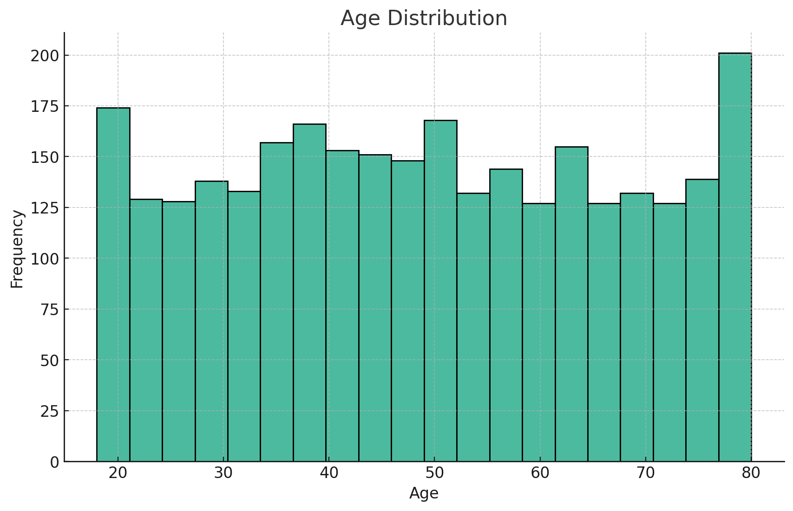

# Global Explainability

## AI Model - ResNet50
The AI model trained to detect diabetic retinopathy is ResNet50, a type of deep convolutional neural network (CNN) that exels at image classification. The model is trained using a supervised approach on a dataset of retinal images that are labeled with the severity degree of diabetic retinopathy.

## Dataset disclosure
The dataset used to train the AI model comprises of 2,929 retina imagery records, each with data points including age, gender, and a diagnosis label. 

The age of individuals ranges from 18 to 80 years, showcasing a wide rage of adult ages that is roughly uniformly scattered across the spectrum. 

The dataset exhibits a significant gender imbalance, with a majority of the entries being female (2,357), compared to 572 male entries. 

Diagnosis labels are distributed across five categories: "No Disease," "Mild," "Moderate," "Severe," and "Very Severe." The most common diagnosis is "No Disease," accounting for nearly half of the cases, followed by "Moderate" and then "Mild" conditions. This distribution highlights the varying freduencies of conditions within the studied population. 

## Model Evaluation
The model overall achieves 88.5% accuracy on 720 unseen data, so doctors can have confidence in the model's diagnosis on new patient's retina imagery.

### Subgroup Evaluation

Gender | Accuracy
------ | --------
Male   | 89.0%
Female | 88.3%

Age    | Accuracy
------ | --------
< 40   | 89.7%
40 ~ 60 | 90.8%
\> 60   | 84.8%

The dataset's demographic and clinical diversity provides a comprehensive foundation for training the AI model. Subgroup evaluation further proves that the model can serve different demographics well. But we acknowledge that there exists class imbalance in several features, such as gender and diagnosis label, due to the nature of the disease.
